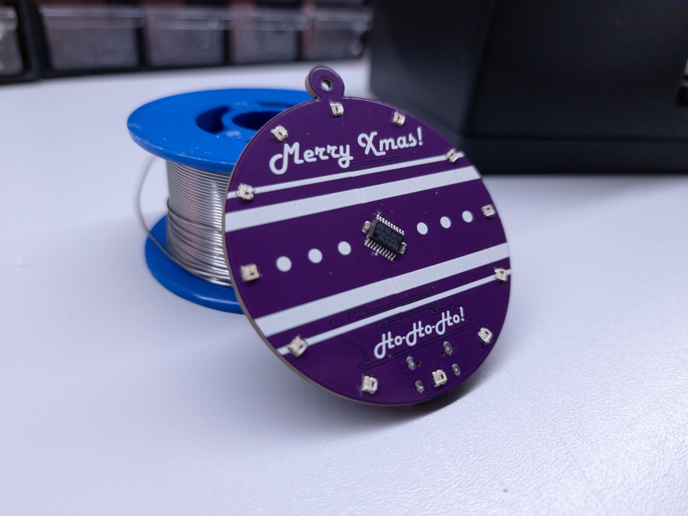
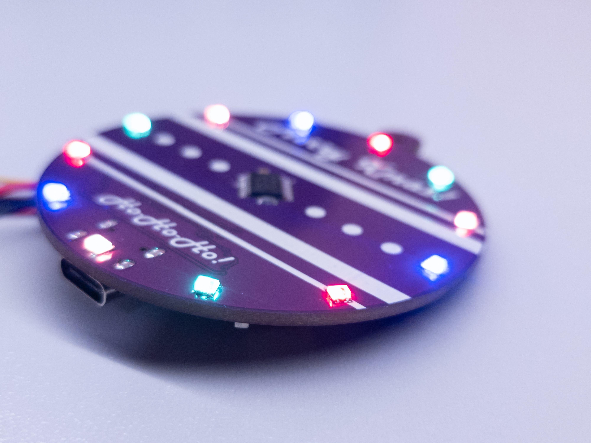

# Xmas-Ornament-2024
New and updated DIY Xmas Ornament based around STM32C011 MCU.

Board features:
- Low power STM32C011F6PF MCU with 48MHz internal clock
- 12 x WS2812B-2020 RGB Adressable LEDs
- Buzzer for playing simple melodies
- Two push buttons both with wake up capability
- JST battry connector
- Li-Ion battery charger
- Low power compatable - 2uA deep sleep current
- USB-C connector for charging

**NOTE:** This project is still in development - Complete firmware still needs to be written. Libraries for the buzzer and WS LEDs are written.

**NOTE2:** PCB has error - STM32 doesn't have connected GND!

