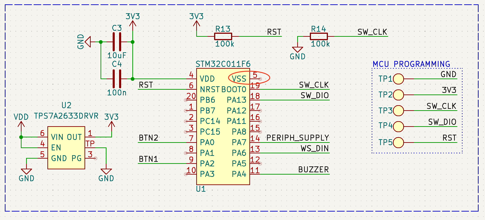
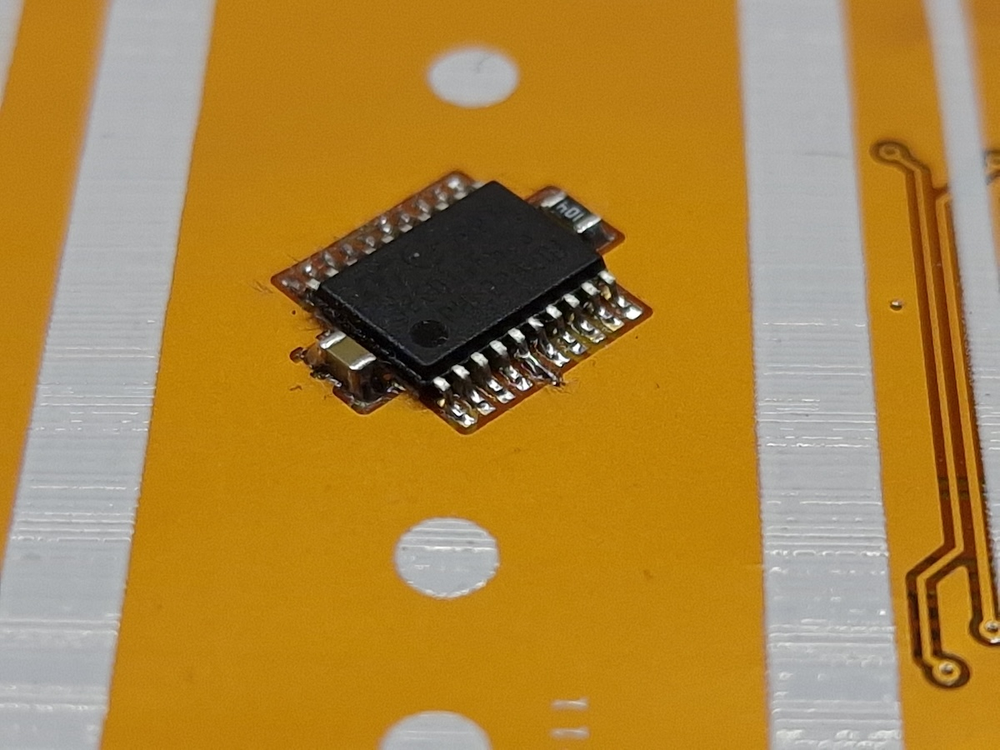
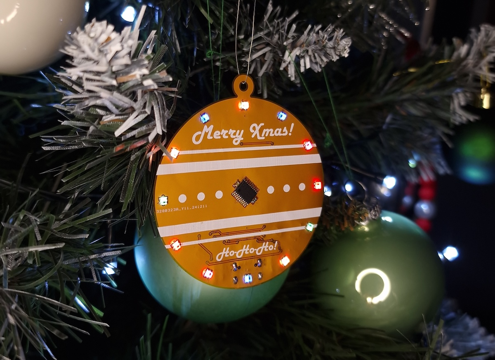

# Xmas Ornament - 2024 update
New and updated DIY Xmas Ornament based around STM32C011 MCU.

# !NOTE!
Before making this project keep in mind that this PCB has an error. It's not fixed in design files, you will need it to fix it yourself!

Issues is that STM32 MCU is missing it's GND.

The fix is to scratch the soldermask and connect GND of the MCU with a piece of very thin wire.

## Board features
- Low power STM32C011F6PF MCU with 48MHz internal clock
- 12 x WS2812B-2020 RGB Adressable LEDs
- Buzzer for playing simple melodies
- Two push buttons both with wake up capability
- JST battry connector
- Li-Ion battery charger
- Low power compatable - 2uA deep sleep current
- USB-C connector for charging

I made two version of the project: one with the flex PCB (ordered from JLCPCB) and the other one with regular two layer FR4 PCB.

Flex PCB version:

FR4 PCB version:

## Board usage:
There are two buttons for controlling the ornament. At moment of connecting the battery, device is on and it's playing the melodies and also blinking the LEDs. Battery used is Li-Ion 3.7V 601220 100mAh Battery. Please check the polarity of. the battery!

- BTN1:
  - Regular button press:
    - Power on if the device is off
    - Change the melody
  - Multiple press: Noting for now. :)
  - Long press: Power down

- BTN2:
  - Regular button press: Change the LED pattern
  - Multiple press: Noting for now. :)
  - Long press: Mute/Unmute the ornament

